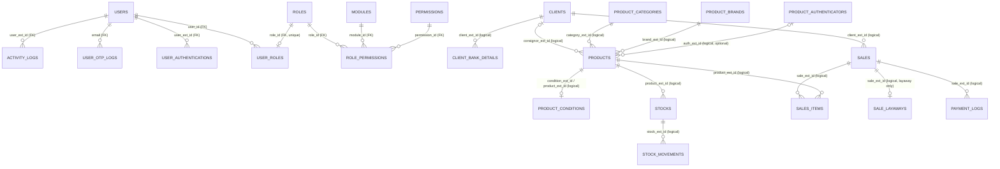

# Database ERD — LWPH SIMS API

Schema as created by the initial migration `src/migrations/1787299956046-InitialSupabaseMigration.ts` (22 tables), cross-checked against the TypeORM entities in `src/modules/*/domain/entities`.

Two kinds of relationships exist:

- **FK** — enforced by a database `FOREIGN KEY` constraint (auth/RBAC/log tables only).
- **Logical** — application-level references via `*_ext_id` columns with **no** database constraint (all sales/products/clients domain tables).

## Entity Relationship Diagram

## Tables

Conventions: all tables have a `SERIAL` primary key `id`. Audit columns follow the pattern `created_at` (NOT NULL, default `now()`), `created_by` (NOT NULL), optional `updated_at`/`updated_by`, and soft-delete `deleted_at`/`deleted_by` where present.

### Users & Authentication

#### `users`

| Column | Type | Constraints |
| --- | --- | --- |
| id | serial | PK |
| external_id | varchar | NOT NULL, **UNIQUE** |
| first_name | varchar | NOT NULL |
| last_name | varchar | NOT NULL |
| email | varchar | NOT NULL, **UNIQUE** |
| is_active | boolean | NOT NULL, default `true` |
| last_login | varchar | nullable |
| created_at / created_by | timestamp / varchar | NOT NULL |
| updated_at / updated_by | timestamp / varchar | nullable |
| deleted_at / deleted_by | timestamp / varchar | nullable |

Referenced by: `activity_logs`, `user_otp_logs`, `user_authentications`, `user_roles` (all FK).

#### `user_otp_logs`

| Column | Type | Constraints |
| --- | --- | --- |
| id | serial | PK |
| email | varchar | NOT NULL, FK → `users.email` |
| token | varchar | nullable (one-time login token) |
| otp | varchar | NOT NULL |
| date_requested | timestamp | NOT NULL, default `now()` |
| date_validated | timestamp | nullable |
| is_used | boolean | NOT NULL, default `false` |
| is_expired | boolean | NOT NULL, default `false` |

#### `user_authentications`

| Column | Type | Constraints |
| --- | --- | --- |
| id | serial | PK |
| user_ext_id | varchar | NOT NULL, FK → `users.external_id` |
| token | varchar | NOT NULL (JWT) |
| token_jti | varchar | NOT NULL |
| token_expiry | varchar | NOT NULL |
| is_active | boolean | NOT NULL, default `true` (revocation flag) |
| created_at / created_by | timestamp / varchar | NOT NULL |

#### `activity_logs`

| Column | Type | Constraints |
| --- | --- | --- |
| id | serial | PK |
| user_ext_id | varchar(50) | NOT NULL, FK → `users.external_id` |
| module | varchar(100) | nullable |
| action | text | nullable |
| description | text | nullable |
| ref_id | varchar(50) | nullable |
| created_at | timestamp | NOT NULL, default `now()` |

### RBAC

#### `roles`

| Column | Type | Constraints |
| --- | --- | --- |
| id | serial | PK |
| name | varchar | NOT NULL |

Seeded: `Admin`, `Staff`.

#### `modules`

| Column | Type | Constraints |
| --- | --- | --- |
| id | serial | PK |
| name | varchar | NOT NULL |
| description | varchar | NOT NULL |

Seeded: Users, Sales, Inventory, Clients, Reports.

#### `permissions`

| Column | Type | Constraints |
| --- | --- | --- |
| id | serial | PK |
| name | varchar | NOT NULL (`Module.action`) |
| description | varchar | NOT NULL |

Seeded: 20 rows (`Users.create`, …, `Reports.delete`).

#### `user_roles`

| Column | Type | Constraints |
| --- | --- | --- |
| id | serial | PK |
| user_id | varchar | NOT NULL, FK → `users.external_id` |
| role_id | integer | NOT NULL, FK → `roles.id`, **UNIQUE** (a role row can be assigned at most once) |
| created_at | timestamp | NOT NULL, default `now()` |

#### `role_permissions`

| Column | Type | Constraints |
| --- | --- | --- |
| id | serial | PK |
| role_id | integer | NOT NULL, FK → `roles.id` |
| module_id | integer | NOT NULL, FK → `modules.id` |
| permission_id | integer | NOT NULL, FK → `permissions.id` |

### Clients

#### `clients`

| Column | Type | Constraints |
| --- | --- | --- |
| id | serial | PK |
| external_id | varchar(10) | NOT NULL |
| first_name | varchar(100) | NOT NULL |
| middle_name | varchar(100) | nullable |
| last_name | varchar(100) | NOT NULL |
| suffix | varchar(10) | nullable |
| birth_date | timestamptz | NOT NULL |
| email | varchar(100) | NOT NULL |
| contact_no | varchar(100) | nullable |
| address | text | nullable |
| instagram | varchar(100) | nullable |
| facebook | varchar(100) | nullable |
| is_consignor | boolean | NOT NULL, default `false` |
| is_active | boolean | NOT NULL, default `true` |
| audit + soft delete | — | created/updated/deleted columns |

Referenced logically by `client_bank_details.client_ext_id`, `sales.client_ext_id`, `products.consignor_ext_id`.

#### `client_bank_details`

| Column | Type | Constraints |
| --- | --- | --- |
| id | serial | PK |
| client_ext_id | varchar(10) | NOT NULL (logical → `clients.external_id`) |
| account_name | varchar(1000) | NOT NULL |
| account_no | varchar(1000) | NOT NULL |
| bank | varchar(1000) | NOT NULL |
| is_active | boolean | NOT NULL, default `true` |
| audit + soft delete | — | created/updated/deleted columns |

### Products & Inventory

#### `products`

| Column | Type | Constraints |
| --- | --- | --- |
| id | serial | PK |
| external_id | varchar | NOT NULL |
| category_ext_id | varchar | NOT NULL (logical → `product_categories.external_id`) |
| brand_ext_id | varchar | NOT NULL (logical → `product_brands.external_id`) |
| auth_ext_id | varchar | nullable (logical → `product_authenticators.external_id`) |
| condition_ext_id | varchar | NOT NULL (logical → `product_conditions.external_id`) |
| consignor_ext_id | varchar | nullable (logical → `clients.external_id`) |
| name | varchar | NOT NULL |
| material / hardware / code / measurement / model | varchar | nullable |
| inclusion | varchar[] | nullable |
| images | varchar[] | nullable |
| cost / price | numeric | NOT NULL |
| is_consigned | boolean | NOT NULL, default `false` |
| consignor_selling_price | numeric | nullable |
| audit + soft delete | — | created/updated/deleted columns |

#### `product_conditions`

| Column | Type | Constraints |
| --- | --- | --- |
| id | serial | PK |
| external_id | varchar(100) | NOT NULL |
| product_ext_id | varchar(100) | NOT NULL (logical → `products.external_id`) |
| interior / exterior / overall / description | text | nullable |
| audit + soft delete | — | created/updated/deleted columns |

#### `product_categories` / `product_brands` / `product_authenticators`

Identical shape:

| Column | Type | Constraints |
| --- | --- | --- |
| id | serial | PK |
| external_id | varchar(100) | NOT NULL |
| name | varchar(100) | NOT NULL |
| audit + soft delete | — | created/updated/deleted columns |

#### `stocks`

| Column | Type | Constraints |
| --- | --- | --- |
| id | serial | PK |
| external_id | varchar(100) | NOT NULL |
| product_ext_id | varchar(100) | NOT NULL (logical → `products.external_id`) |
| is_consigned | boolean | NOT NULL, default `false` |
| consigned_date | timestamp | nullable |
| min_qty | integer | NOT NULL, default `0` |
| avail_qty | integer | NOT NULL, default `0` |
| sold_qty | integer | NOT NULL, default `0` |
| audit + soft delete | — | created/updated/deleted columns |

#### `stock_movements`

| Column | Type | Constraints |
| --- | --- | --- |
| id | serial | PK |
| external_id | varchar(100) | NOT NULL |
| stock_ext_id | varchar(100) | NOT NULL (logical → `stocks.external_id`) |
| type | varchar(100) | NOT NULL (e.g. increase/decrease/sale/cancel) |
| source | varchar(100) | NOT NULL |
| qty_before | integer | NOT NULL |
| qty_change | integer | NOT NULL |
| qty_after | integer | NOT NULL |
| created_at / created_by | timestamp / varchar | NOT NULL |

### Sales

#### `sales`

| Column | Type | Constraints |
| --- | --- | --- |
| id | serial | PK |
| external_id | varchar(100) | NOT NULL |
| client_ext_id | varchar(100) | NOT NULL (logical → `clients.external_id`) |
| type | varchar(1) | NOT NULL (`R` regular, `L` layaway) |
| total_amount | numeric | NOT NULL |
| is_discounted | boolean | NOT NULL, default `true` |
| discount_percent | numeric | NOT NULL, default `0` |
| discount_flat_rate | numeric | NOT NULL, default `0` |
| date_purchased | timestamp | NOT NULL |
| status | varchar | NOT NULL |
| images | varchar[] | nullable |
| cancelled_at / cancelled_by | timestamp / varchar(100) | nullable |
| audit | — | created columns only |

#### `sales_items`

| Column | Type | Constraints |
| --- | --- | --- |
| id | serial | PK |
| external_id | varchar(100) | NOT NULL |
| sale_ext_id | varchar(100) | NOT NULL (logical → `sales.external_id`) |
| product_ext_id | varchar(100) | NOT NULL (logical → `products.external_id`) |
| qty | integer | NOT NULL |
| unit_price | numeric | NOT NULL |
| subtotal | numeric | NOT NULL |
| audit + soft delete | — | created/updated/deleted columns |

#### `sale_layaways`

| Column | Type | Constraints |
| --- | --- | --- |
| id | serial | PK |
| sale_ext_id | varchar(100) | NOT NULL (logical → `sales.external_id`) |
| no_of_months | integer | NOT NULL |
| amount_due | numeric | NOT NULL |
| payment_date | timestamp | nullable |
| current_due_date | timestamp | NOT NULL |
| orig_due_date | timestamp | NOT NULL |
| is_extended | boolean | NOT NULL, default `false` |
| status | varchar(20) | NOT NULL |
| audit | — | created/updated columns |

#### `payment_logs`

| Column | Type | Constraints |
| --- | --- | --- |
| id | serial | PK |
| external_id | varchar(100) | NOT NULL |
| sale_ext_id | varchar(100) | NOT NULL (logical → `sales.external_id`) |
| amount | numeric | NOT NULL |
| payment_date | timestamp | NOT NULL |
| payment_method | varchar(100) | NOT NULL |
| is_deposit | boolean | NOT NULL |
| is_final_payment | boolean | NOT NULL |
| audit + soft delete | — | created/deleted columns |

## Indexes & Constraints Summary

- **Unique constraints:** `users.external_id`, `users.email`, `user_roles.role_id`.
- **Foreign keys:** the 8 listed in the diagram above; every other relationship is logical only (no DB enforcement, no `ON DELETE` behaviour).
- No secondary indexes are created by migrations beyond PKs/uniques/FK supports.
